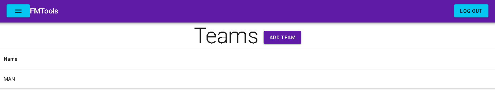
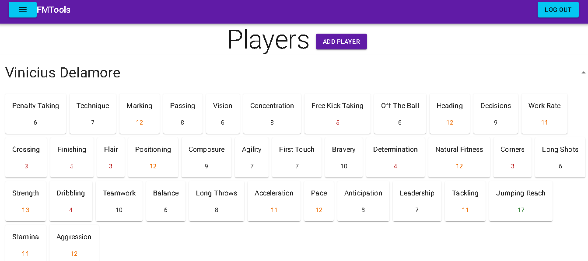
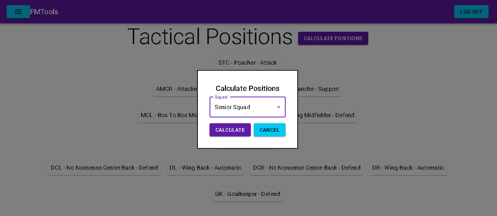
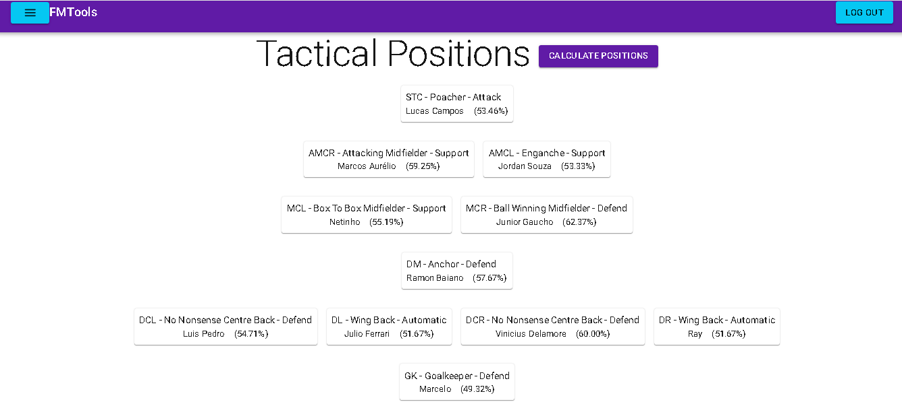

# FMTools


## About

> Web App with tools to help Football Manager gameplay

### Built With

* [](#)
* [](#)
* [](#)
* [](#)
* [](#)
* [](#)
* [](#)

### Updates and Adjustments

The project is still under development and next updates will focus on:

- [ ] Update information like teams, squads, etc
- [ ] Delete information like teams, squads, etc
- [ ] Display logged user info
- [ ] Increment informations to be managed

## 💻 Prerequisites

- Docker and Docker Compose installed

## Accessing FMTools online

A demonstrative version, full functional, is hosted online [here](https://fmtools.denison.corbal.nom.br)

## 🚀 Running FMTools locally

Clone the repository, access the main folder and run
```
docker compose up -d --build
```

Docker will pull the database image and build the frontend and backend images, then will run all of them.

After that you will be able to access the project on http://localhost:3000.

## ☕ Using FMTools

As it happens on the game you can manage Teams, Squads, Tactics, Tactical Styles, Formations and Players.



You can add players by the .html or .rtf generated on the game.



On formation screen you can access the functionality to calculate best formation. You just need to have one squad with at least 11 players and then choose to calculate.



After that system will display the formation with the names calculated for each position. (In order to calculate the result the system will consider ONLY the player stats and the key and preferable stats for each position on formation).



## 📝 License

This project is under [license](LICENSE.md).